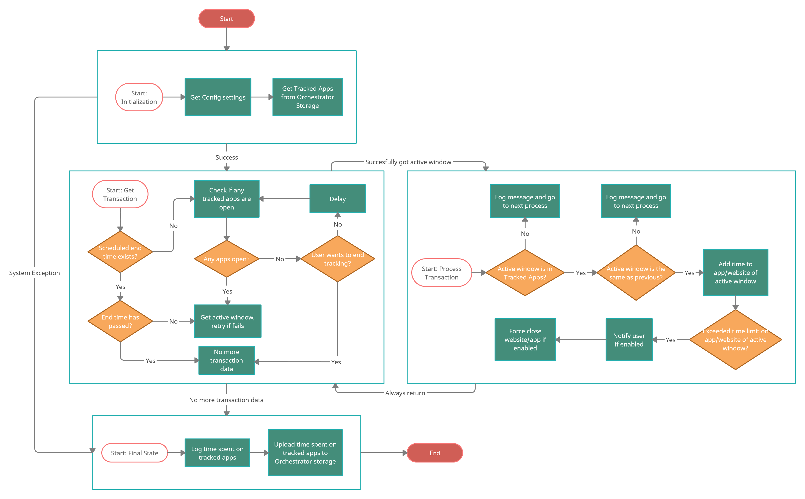
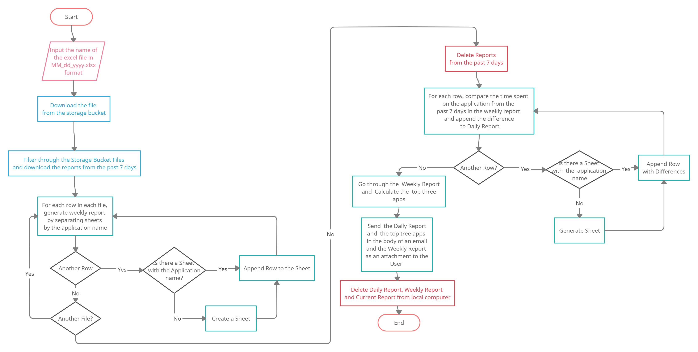

# Computer Time Tracker

### Project Overview
We have designed an automation that uses UiPath robots to track the time spent on applications and websites on the computer. The apps/websites to track are specified in an Excel sheet and tracking is based on the active window of the user’s window.
At the end of a tracking session, the tracking data is saved in an online database (Orchestrator Storage Bucket). A report with comparisons for the past week and the top three most used apps/websites is sent in an email.

This automation can be used as personal time management tool to help limit time spent on apps/websites. 

#### FlowCharts

### Technologies Used
* UiPath Studio
* UiPath Robot
* UiPath Orchestrator
* Microsoft Excel
* Microsoft Outlook

### Functionalities
* Can track apps/websites for the day which are listed in the TrackedApps.xlsx saved in a Orchestrator storage bucket
* Set a time limit for apps/websites
* Warns the user if there are 5 minutes remaining and closes the application if the time exceeds the set limit if specified in the TrackedApps.xlsx
* Uploads the tracked records of a days session in an Excel file to a storage bucket on Orchestrator
* Can schedule an end time for tracking using an input parameter in Orchestrator
* Calculate difference in time spent on apps/websites compared to other days in a week and send a report in an email
* Determines the top three most used apps/websites in the past seven days

### Getting Started
In order to run project you will need the following environment(s):
* Git Bash
* UiPath Studio
* UiPath Robot
* UiPath Orchestrator
* Microsoft Excel
* Microsoft Outlook

Right Click inside the folder you wish to save the project and click 'Git Bash Here'

Run the following git commands in order to download the project onto your machine:
* git clone 

Connect your machine to Orchestrator. Follow the directions in the link: 
* https://docs.uipath.com/orchestrator/docs/managing-robots-modern-folders.

Create two storage buckets with the following names: DailyTrackedTimes and TrackedAppsSettings.

In TrackedAppsSettings upload an excel file TrackedApps.xlsx with the following Column Names: Name, Time Limit,	Notification, Force Close and Type. 

In the Name column specify the name of the website or the the executable file name for an app. In the Time Limit column, specify a time limit in hh:mm:ss format. For Notification and Force Close specify a boolean value. Lastly in Type, Insert 'Website' or 'App'.

Lastly, create an asset called 'UserEmail' and store an email to send the Report to. 

### Usage
Navigate to the ComputerTimeTracker folder and click Main.xaml. This opens our automation in UiPath Studio. 

Here input an end time in the arguments tab in a DateTime format "yyyy-MM-ddThh:mm:ss" (including the quotes). 

Click Run and the ComputerTimeTracker will start tracking until the end time or if the user does not have any of the tracked apps/websites open. 

After our ComputerTimeTracker ends, it will push the days report in our DailyTrackedTimes storage bucket with the filename as the days date (in MM_dd_yyyy.xlsx format). 

Next, Navigate to CalculateWeeklyReport folder and click Main.xaml. 

Input the name of a report in our storage bucket to base the weekly report on (in the MM_dd_yyyy.xlsx format). 

Click run and you should receive a report on your weekly comparisons and your top three most used apps. 

### Contributors
Andres Siles-Loayza, Shantel Chi, Shalei Kumar 

### License
This project uses the following license: MIT License.
